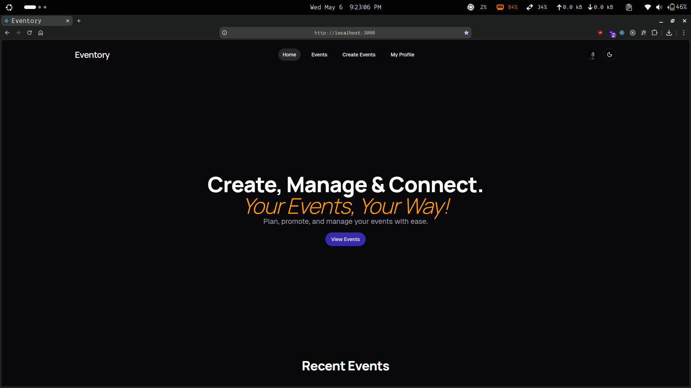
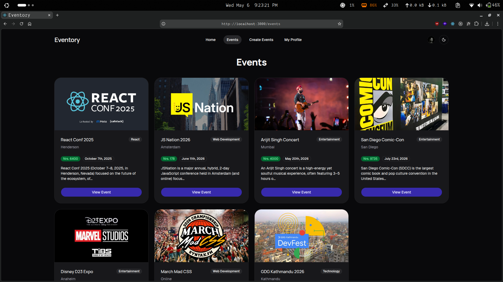
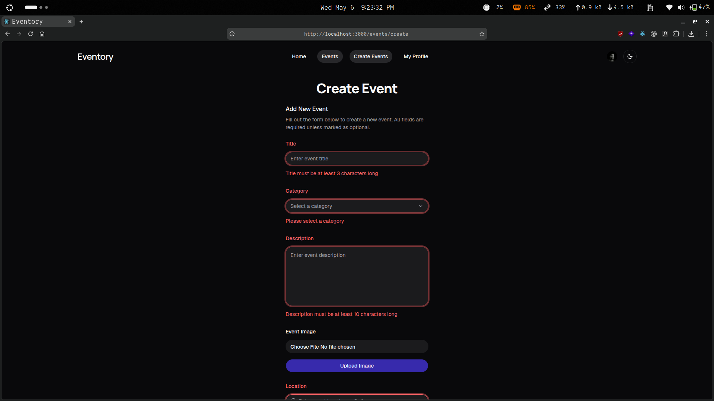
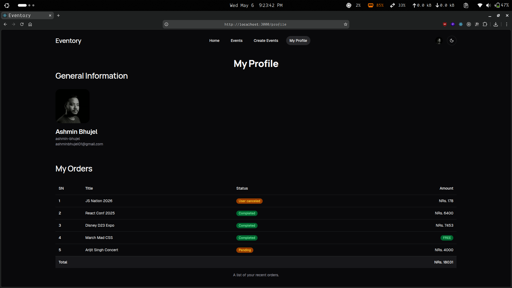

# Eventory

A full-stack event management platform for planning, creating and managing in-person, virtual or hybrid events.

## Features

- Built a full-stack web application for event management using Bun, TypeScript, React.js, TanStack
  Start and MongoDB.
- Built a back-end service using TanStack Start’s server functions and API routes.
- Used Tailwind CSS and shadcn/ui for the responsive and accessible UI.
- Integrated user authentication and authorization using Clerk’s robust Auth service.
- Used TanStack Form for client-side forms and Zod for the user input data validation in both client-
  side and server-side.
- Implemented DAM (Digital Assets Management) using Imagekit. Mostly for image upload and
  handling.
- Used Open Weather geocoding and mapcn for implementing the location map component.
- Integrated payments using Khalti’s payment gateway.

## Technology Stack

Thanks to all these amazing tools and technologies. Really greatful for all of them and had a great time building with them. ✨

- [Bun](https://bun.com/) - All in one JS toolkit, runtime, package manager
- [TypeScript](https://www.typescriptlang.org/) - JS but with super powers
- [Vite](https://vite.dev/) - The build tool for the web
- [React](https://react.dev/) - The library for web and native user interfaces
- [TanStack Start](https://tanstack.com/start/latest) - Full-stack Framework powered by TanStack Router for React and Solid
- [TanStack Router](https://tanstack.com/router/latest) - Type-safe Routing for React and Solid applications
- [TanStack Query](https://tanstack.com/query/latest) - Powerful asynchronous state management, server-state utilities and data fetching
- [TanStack Form](https://tanstack.com/form/latest) - Headless UI for building performant and type-safe forms
- [Tailwind CSS](https://tailwindcss.com/) - A utility-first CSS framework packed with classes
- [shadcn/ui](https://ui.shadcn.com/) - The Foundation for your Design System
- [mapcn](https://www.mapcn.dev/) - Beautiful maps, made simple
- [Zod](https://zod.dev/) - TypeScript-first schema validation with static type inference
- [Clerk](https://clerk.com/) - More than authentication, Complete User Management
- [MongoDB](https://cloud.mongodb.com) - Open-source, document-oriented NoSQL database designed for high performance, flexibility, and scalability
- [ImageKit](https://imagekit.io/) - Image and Video API plus Digital Asset Management
- [Vercel](https://vercel.com/) - Vercel enables the world to ship the best products

## Preview

